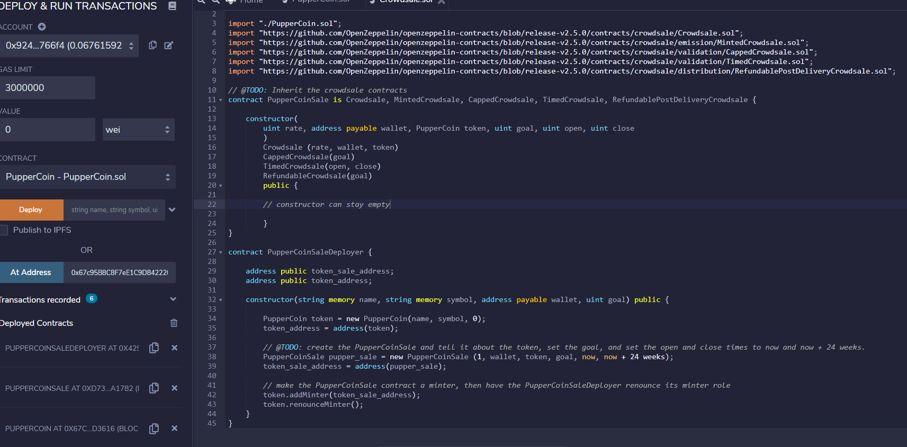
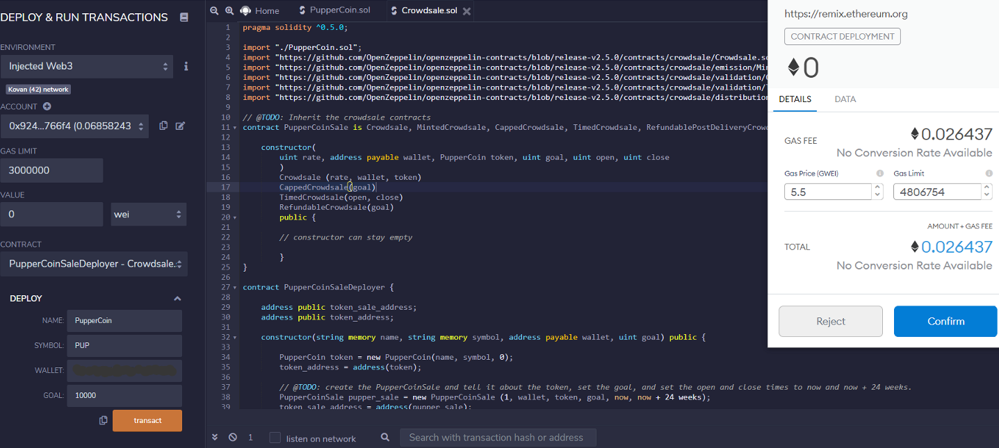
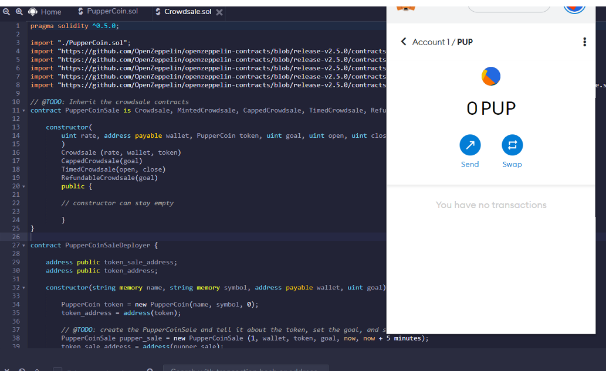
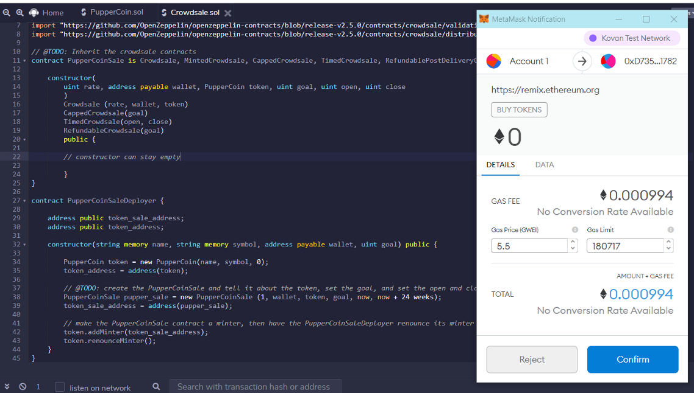

# Advanced_Solidity_Homework
# Hamza Mhadi
# May 2021 

1. Compile PupperCoin and Crowdsale Files 
2. Compile PupperCoinSaleDepoloyer first on Kovan Testnet

Name: PupperCoin
Symbol: PUP Wallet://copy the account address and paste it//Goal:10,000

3. PupperCoinSaleDeployer Contract 

4. Change contract to PupperCoinSale and paste token_sale_address next to At Address heading and deploy 
5. Change the contract to PupperCoin and paste the token_address next to Address heading & deploy 

6. Add token to your Metamask by copying the token_sale_address 

7. Test to buy PupperCoin

